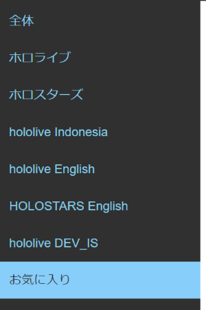

# crx-holodule-filter

ホロジュール[^holodule]をタレント毎にフィルターできるGoogle Chrome拡張機能です。

この拡張機能をインストールすると、ホロジュールのメニューにお気に入りが追加され、フィルターで選択したタレント・グループだけを表示できるようになります。

さらに、ホロライブ(JP)＋DEV_IS、ホロライブ全体、ホロスターズ全体のメニューも追加されます。

フィルターの設定はツールバーのブラウザ拡張アイコンから行えます。

  
  

[^holodule]: ホロライブプロダクション所属VTuberの配信が分かるスケジュールサイト

## 導入手順

### chromeウェブストアから導入

https://chromewebstore.google.com/detail/holodule-filter/kjklpmbpcgppkmpfkohjfhjbmeekbafp

### デベロッパー モードを有効にして導入

デベロッパー モードを有効にして入れる場合、以下の手順で導入できます。

> note
>
> 注意: Chrome ウェブストアを経由しないため、導入は自己責任でお願いします。

- `Code`ボタンを押し`Download ZIP`を選択する
- ダウンロードしたzipファイルを展開する
- Google Chromeのメニューから`[拡張機能]-[拡張機能を管理]`を開く
  - アドレスバーから`chrome://extensions/`を開いてもOK
- 画面右上の`デベロッパー モード`を有効にする
- `パッケージ化されていない拡張機能を読み込む`ボタンを押す
- 展開したフォルダの中の`src`フォルダを選択する

## 使い方

- ツールバーのパズルピースアイコンを押し`holodule filter`を選択する
- 表示したいグループにチェックを入れる
- [ホロジュール](https://schedule.hololive.tv/lives)の`お気に入り`メニュー項目を選択する

## ライセンス

Apache License 2.0
